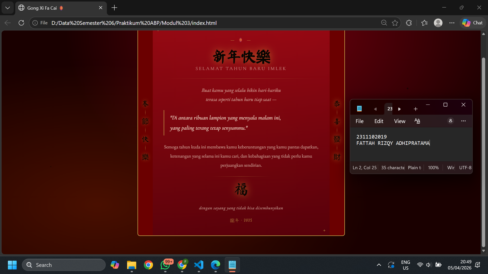

   
  <h1>LAPORAN PRAKTIKUM   APLIKASI BERBASIS PLATFORM </h1>
   
  <h3>MODUL 3   CSS </h3>
   
  
   
   
   
  <h3>Disusun Oleh :</h3>
  

    <strong>Fattah Rizqy Adhipratama</strong>
     
    <strong>2311102019</strong>
     
    <strong>S1 IF-11-REG05</strong>
  

   
  <h3>Dosen Pengampu :</h3>
  

    <strong>Dedi Agung Prabowo, S.Kom., M.Kom</strong>
  

   
   
  <h4>Asisten Praktikum :</h4>
  <strong>Apri Pandu Wicaksono </strong>
   
  <strong>Hamka Zaenul Ardi</strong>
   
  <h3>LABORATORIUM HIGH PERFORMANCE  FAKULTAS INFORMATIKA  UNIVERSITAS TELKOM PURWOKERTO  2026 </h3>

# Dasar Teori

CSS (Cascading Style Sheets) merupakan bahasa yang digunakan untuk mengatur tampilan dan tata letak halaman web. CSS bekerja dengan cara memisahkan bagian struktur halaman yang dibuat menggunakan HTML dengan bagian desain atau tampilannya, seperti warna, ukuran teks, jarak antar elemen, dan posisi objek pada halaman.

Dengan menggunakan CSS, tampilan website menjadi lebih rapi, menarik, dan mudah dikelola. Selain itu, penggunaan CSS juga memudahkan pengembang ketika ingin melakukan perubahan desain karena cukup mengubah file stylesheet tanpa harus mengedit struktur HTML secara langsung.

CSS memiliki tiga cara penerapan, yaitu inline CSS, internal CSS, dan external CSS. Inline CSS ditulis langsung pada tag HTML, internal CSS ditulis di dalam tag <style> pada file HTML, sedangkan external CSS ditulis pada file terpisah dengan ekstensi .css. Dari ketiga cara tersebut, external CSS paling sering digunakan karena lebih efisien dan mudah digunakan kembali pada banyak halaman. Dalam penerapannya, CSS menggunakan selector untuk memilih elemen HTML yang akan diberikan gaya, lalu diikuti dengan properti dan nilai. Contohnya seperti mengatur warna teks menggunakan color, ukuran huruf dengan font-size, dan warna latar belakang menggunakan background-color.

# Tugas 3 - Project Bucin (Edisi Imlek)
## 1. Source code index.html
<!-- 2311102019
Fattah Rizqy Adhipratama
S1IF-11-05 -->

<!DOCTYPE html>
<html lang="id">

<head>
  <meta charset="UTF-8" />
  <meta name="viewport" content="width=device-width, initial-scale=1.0" />
  <title>Gong Xi Fa Cai 🏮</title>
  <link href="https://fonts.googleapis.com/css2?family=Ma+Shan+Zheng&family=Cormorant+Garamond:ital,wght@0,300;0,600;1,300;1,500&family=EB+Garamond:ital,wght@0,400;1,400&display=swap" rel="stylesheet" />
  <link rel="stylesheet" href="style.css" />
</head>
<body>

  

    

    ✦
    ✦
    ✦
    ✦
    ✦
    ✦
  

  

    <!-- Kiri: dekorasi vertikal -->
    <aside class="side side--left" aria-hidden="true">
      春
      

      節
      

      快
      

      樂
    </aside>

    <!-- Card utama -->
    <main class="card">

      <!-- Header card -->
      <header class="card__header">
        — 🏮 —
        <h1 class="card__title">
          新年快樂
          Selamat Tahun Baru Imlek
        </h1>
      </header>

      

      <!-- Pesan utama -->
      <section class="card__message">
        
Buat kamu yang selalu bikin hari-hariku terasa seperti tahun baru tiap saat —

        <blockquote class="msg__quote">
          "Di antara ribuan lampion yang menyala malam ini, 
          yang paling terang tetap senyummu."
        </blockquote>

        

          Semoga tahun kuda ini membawa kamu keberuntungan yang kamu pantas dapatkan,
          ketenangan yang selama ini kamu cari, dan kebahagiaan yang tidak perlu
          kamu perjuangkan sendirian.
        

      </section>

      

      <!-- Footer card -->
      <footer class="card__footer">
        福
        
dengan sayang yang tidak bisa disembunyikan

        龍年 · 2025
      </footer>

    </main>

    <!-- Kanan: dekorasi vertikal -->
    <aside class="side side--right" aria-hidden="true">
      恭
      

      喜
      

      發
      

      財
    </aside>

  

</body>
</html>

## 2. Source Code style.css
**Source Codenya:** [style.css](./style.css)

# Output

# Penjelasan

Program ini merupakan halaman web yang dibuat menggunakan HTML dan CSS murni (pure CSS) tanpa bantuan JavaScript maupun framework styling seperti Bootstrap dan Tailwind CSS. Tujuan dari project ini adalah menampilkan ucapan bertema Tahun Baru Imlek dengan nuansa visual yang elegan, romantis, dan khas budaya Tionghoa.

Pada file index.html, struktur halaman disusun menggunakan elemen semantik HTML seperti <header>, <main>, <section>, <footer>, dan <aside>. Penggunaan elemen tersebut membuat struktur halaman menjadi lebih rapi dan mudah dipahami. Bagian awal halaman berisi elemen dekoratif latar belakang berupa efek cahaya dan bintang kecil yang ditempatkan di dalam class bg. Setelah itu terdapat container utama dengan class page yang membagi tampilan menjadi tiga bagian, yaitu panel kiri, kartu utama, dan panel kanan.

Panel kiri dan kanan menggunakan elemen <aside> yang berisi karakter Mandarin vertikal sebagai dekorasi khas Imlek, seperti 春節快樂 dan 恭喜發財. Di bagian tengah terdapat elemen <main> dengan class card yang menjadi fokus utama tampilan. Card ini berisi judul ucapan Tahun Baru Imlek, pesan romantis, kutipan, serta footer yang menampilkan simbol keberuntungan 福.

Pada file style.css, tampilan halaman diatur menggunakan CSS custom dengan memanfaatkan CSS variables pada selector :root untuk mendefinisikan warna utama seperti merah gelap, emas, dan krem. Warna-warna tersebut dipilih untuk memperkuat identitas visual Imlek. Layout halaman menggunakan Flexbox sehingga elemen dapat tersusun rapi dan responsif.

Secara keseluruhan, tugas ini menunjukkan penggunaan HTML semantik, Flexbox, CSS variables, pseudo-element, keyframes animation, dan responsive design untuk menghasilkan halaman web bertema Imlek yang menarik secara visual dan tetap sesuai ketentuan.

